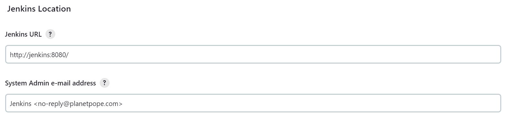
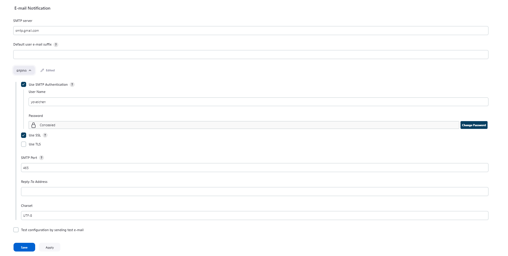

# CI steps for manual Surf application

To begin, clone this repository by running:
```
git clone https://gitlab.com/sela-1090/collaboration/applications/surf-booking/application.git
```

build the docker file using the following command:
```
cd application
docker build -t lioratari/surf-booking:<version> .
```

To run the unit-tests, use:
```
pytest test_app.py
```

To build the Helm package, run:
```
helm package surf-booking-chart
```

```
docker login
docker push lioratari/surf-booking:<version>
helm push surf-booking-chart.tgz
```
To deploy the application manually, run:
```
helm install surf-app oci://registry-1.docker.io/lioratari/surf-booking-chart --version <desired version> --set postgresql.host=<DB IP> --set postgresql.database=<DB name> --set postgresql.password=<DB password> --set image.tag=<version>
```
Alternativly, you can create a custom values.yaml file as shows below and run:  
```
surf-app oci://registry-1.docker.io/lioratari/surf-booking-chart --version <desired version> -f values.yaml
```
values.yaml
```
---
image:
  tag: "<version>"
postgresql:
  host: "<host>"
  password: "<password>"
  database: "<database>"
```

## Jenkins pipeline email on failure: 
1. In Jenkins go to Manage Jenkins > System and make these changes: 
- System Admin e-mail address: you can change it to be your email or an no-reply address
  
-  E-mail Notification: if you are facing any issues with inserting password check [this](https://support.google.com/accounts/answer/185833#zippy=), you might need to create 2SV (Two-Step Verification)
  

2. In Jenkins create a new job > multibranch pipeline
3. In configuration insert the branch source (in this case:https://gitlab.com/sela-1090/collaboration/applications/surf-booking/application.git )
4. if you gave your Jenkinsfile a diffrent name, specify it under Build Configuration > Script Path
5. you can choose the intervals you want under Scan Multibranch Pipeline Triggers (in this case - 1 minute)

### Insert this to you Jenkinsfile, this will trigger when the Jenkins jobs failed

```
    $ stages {
        stage('Hello') {
            steps {
                echo "Hello world"
                    }
            }
        }
        post{
            failure{
                mail to: "naivetechblog@gmail.com",
                subject: "jenkins build:${currentBuild.currentResult}: ${env.JOB_NAME}",
                body: "${currentBuild.currentResult}: Job ${env.JOB_NAME}\nMore Info can be found here: ${env.BUILD_URL}"
        }
    }
    
```
## Steps to customize your Logo in Jenkins:

1. Get your avatar logo in gitlab and upload it into the Jenkins repo
2. after you uploaded, right click on the image and select "copy image address"
3. Install Simple Theme Plugin in jenkins
4. Go to Manage Jenkins → Configure System → Theme → Extra CSS
5. paste this code and change the URL to the one you uploaded to GitLab

/* Custom Jenkins Logo */
.logo {
  /* Hide the default logo */
  display: none;
}

.logo::before {
  /* Set the custom logo image */
  content: url("https://gitlab.com/sela-1090/students/lioratari/infrastructure_sg/jenkins/-/raw/main/snorlax.png");
  /* Add any additional styles for the logo, if needed */
  display: inline-block;
  width: 50px; /* Adjust the width to fit your logo's dimensions */
  height: 50px; /* Adjust the height to fit your logo's dimensions */
}

/* Custom Jenkins Name */


#jenkins-home-link {
  /* Hide the default text */
  display: none;
}

## Credits:
1. https://naiveskill.com/jenkins-pipeline-email-notification/
2. https://www.google.com/search?sxsrf=AB5stBhTjGUX5ZdX5ux4_JS7-VBqG2pIoA:1690451666688&q=how+to+send+an+email+for+a+multibranch+job+in+jenkins&spell=1&sa=X&ved=2ahUKEwjX7eiYz66AAxXohf0HHRSDAy0QBSgAegQIBxAB#fpstate=ive&vld=cid:2450cb43,vid:OOCvCdZLAhc
    


